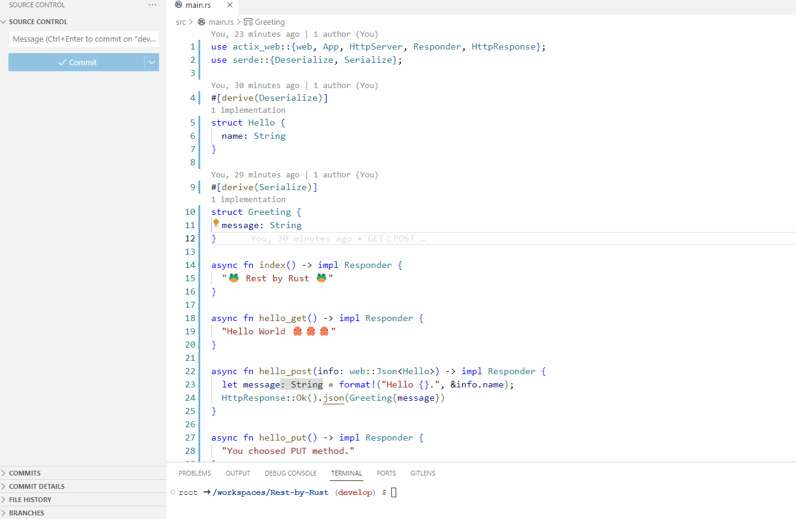

# Rest-by-Rust

🚲🚲🚲 RustでRESTfulAPIを実装してみる。  

  

## 実行方法

DevContainerに入って、以下のコマンドを実行。  

```shell
# デバグ実行
cargo run

# 通常ビルド
cargo build --release --target-dir ./bin
./bin/release/rest-by-rust
```

以下のパスにアクセスしてみる。  

- /
- /api/hello (GET)
- /api/hello (POST) - JSON形式でnameプロパティに値をセット
- /api/hello (PUT)
- /api/hello (DELETE)

Dockerfileから直接実行するには、以下のコマンドを実行。  

```shell
docker build -t rest-by-rust .
docker run -it --rm -p 8080:8080 --name my-rest-by-rust rest-by-rust
```

## 補足

本当は以下のようなDockerfileを書きたかったけど、`cargo install`コマンドってプログラムのエントリポイントがないといけないらしい、、、  
エントリポイントは修正することが多いから、レイヤ構築によるパフォーマンス最適化はできないのかな？？？  
